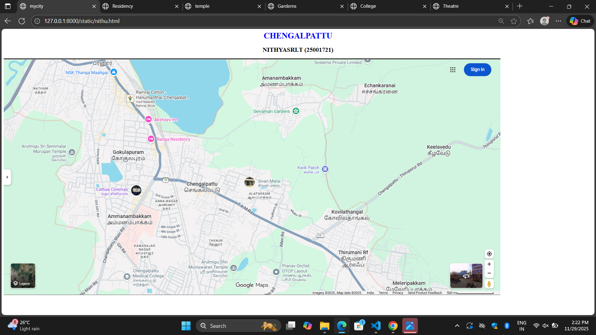
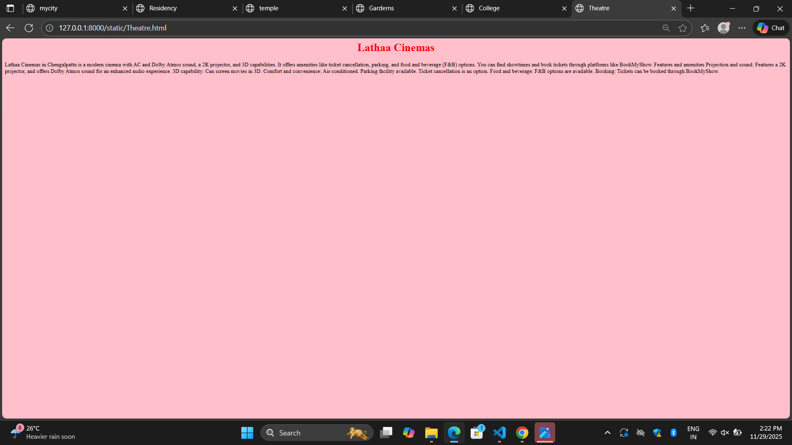
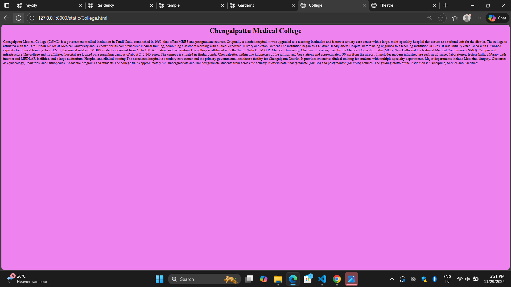
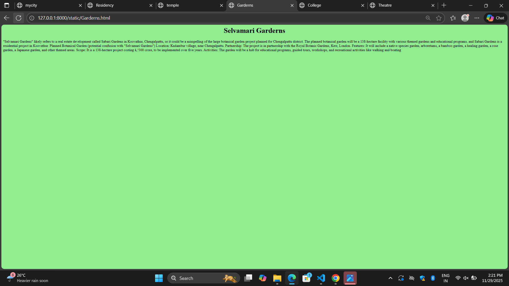
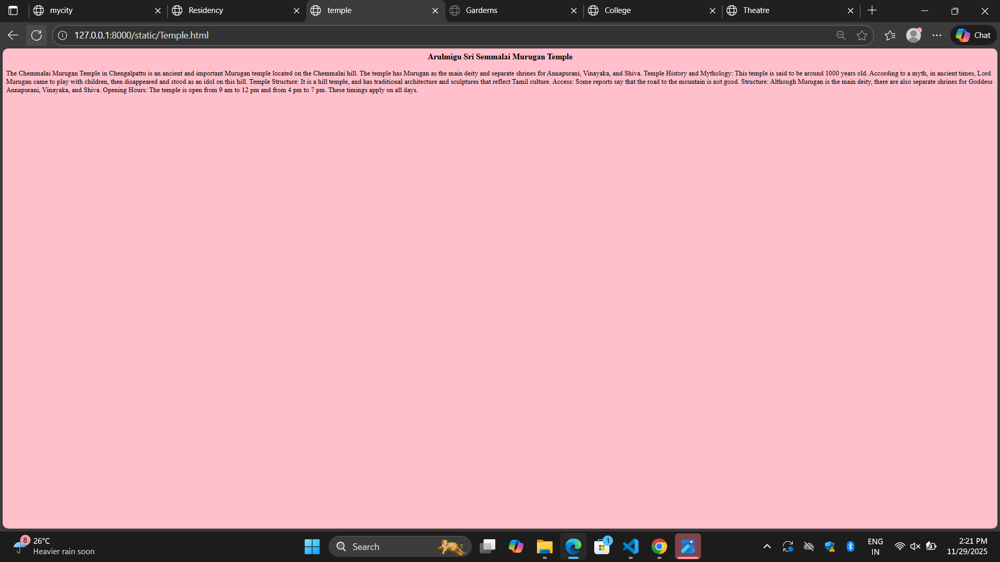
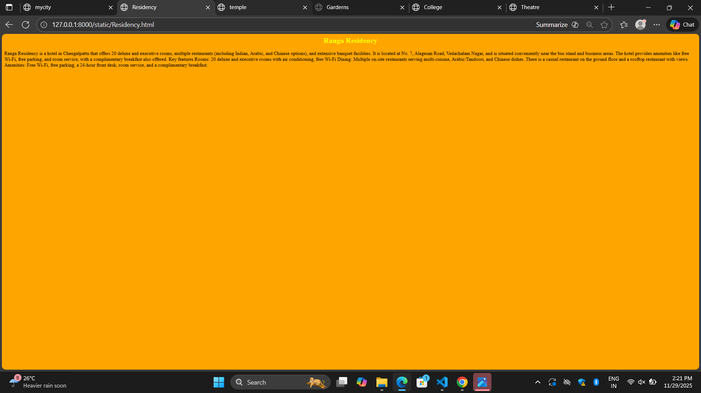

# Ex03 Places Around Me
## Date: 

## AIM
To develop a website to display details about the places around my house.

## DESIGN STEPS

### STEP 1
Create a Django admin interface.

### STEP 2
Download your city map from Google as an image.

### STEP 3
Insert the image using `````` tag and link it to the map.

### STEP 4
Using ```<map>``` tag name the map.

### STEP 5
Create clickable regions in the image using ```<area>``` tag.

### STEP 6
Write HTML programs for all the regions identified.

### STEP 7
Execute the programs and publish them.

## CODE
```
nithu.html

<html>
    <head>
        <title>mycity</title>
    </head>
    <body>
        <h1 align="center"><font color="blue">CHENGALPATTU</font></h1>
        <h2 align="center"><font color="black">NITHYASRI.T (25001721)</font></h2>
        
        
        

<map name="image-map">
    <area target="" alt="Ranga Reasidency" title="Ranga Reasidency" href="Residency.html" coords="546,278,734,338" shape="rect">
    <area target="" alt="Arulmigu Sri Semmalai Murugan Temple" title="Arulmigu Sri Semmalai Murugan Temple" href="Temple.html" coords="169,365,107" shape="circle">
    <area target="" alt="Selvamari Garderns" title="Selvamari Garderns" href="Garderns.html" coords="" shape="poly">
    <area target="" alt="Chengalpattu Medical College" title="Chengalpattu Medical College" href="College.html" coords="466,796,634,892" shape="rect">
    <area target="" alt="Lathaa Cinemas" title="Lathaa Cinemas" href="Theatre.html" coords="427,513,74" shape="circle">
</map>

    </body>
</html>

Theatre.html

<html>
    <head>
        <title>Theatre</title>
    </head>
    <body bgcolor="pink">
        <h1 align="center"><font color="red">Lathaa Cinemas</font></h1>

        Lathaa Cinemas in Chengalpattu is a modern cinema with AC and Dolby Atmos sound, a 2K projector, and 3D capabilities. It offers amenities like ticket cancellation, parking, and food and beverage (F&B) options. You can find showtimes and book tickets through platforms like BookMyShow. 
Features and amenities
Projection and sound: Features a 2K projector, and offers Dolby Atmos sound for an enhanced audio experience.
3D capability: Can screen movies in 3D.
Comfort and convenience:
Air-conditioned.
Parking facility available.
Ticket cancellation is an option.
Food and beverage: F&B options are available.
Booking: Tickets can be booked through BookMyShow. 
  </body>
</html>
college.html
<html>
    <head>
        <title>College</title>
    </head>
    <body bgcolor="violet">
        <h1 align="center"><font color="black">Chengalpattu Medical College</font></h1>

        Chengalpattu Medical College (CGMC) is a government medical institution in Tamil Nadu, established in 1965, that offers MBBS and postgraduate courses. Originally a district hospital, it was upgraded to a teaching institution and is now a tertiary care center with a large, multi-specialty hospital that serves as a referral unit for the district. The college is affiliated with the Tamil Nadu Dr. MGR Medical University and is known for its comprehensive medical training, combining classroom learning with clinical exposure. 
History and establishment
The institution began as a District Headquarters Hospital before being upgraded to a teaching institution in 1965.
It was initially established with a 250-bed capacity for clinical training.
In 2012-13, the annual intake of MBBS students increased from 50 to 100. 
Affiliation and recognition
The college is affiliated with the Tamil Nadu Dr. M.G.R. Medical University, Chennai.
It is recognized by the Medical Council of India (MCI), New Delhi and the National Medical Commission (NMC). 
Campus and infrastructure
The college and its affiliated hospital are located on a sprawling campus of about 240-265 acres.
The campus is situated in Highgrounds, Chengalpattu, within two kilometers of the railway and bus stations and approximately 30 km from the airport.
It includes modern infrastructure such as advanced laboratories, lecture halls, a library with internet and MEDLAR facilities, and a large auditorium. 
Hospital and clinical training
The associated hospital is a tertiary care center and the primary governmental healthcare facility for Chengalpattu District.
It provides extensive clinical training for students with multiple specialty departments.
Major departments include Medicine, Surgery, Obstetrics & Gynecology, Pediatrics, and Orthopedics. 
Academic programs and students
The college trains approximately 500 undergraduate and 100 postgraduate students from across the country.
It offers both undergraduate (MBBS) and postgraduate (MD/MS) courses.
The guiding motto of the institution is "Discipline, Service and Sacrifice". 
    </body>
</html>

Garderns.html

<html>
    <head>
        <title>Garderns</title>
    </head>
    <body bgcolor="lightgreen">
        <h1 align="center"><font color="black">Selvamari Garderns</font></h1>

        "Selvamari Gardens" likely refers to a real estate development called Sabari Gardens in Koovathur, Chengalpattu, or it could be a misspelling of the large botanical garden project planned for Chengalpattu district. The planned botanical garden will be a 138-hectare facility with various themed gardens and educational programs, and Sabari Gardens is a residential project in Koovathur. 
Planned Botanical Garden (potential confusion with "Selvamari Gardens")
Location: Kadambur village, near Chengalpattu.
Partnership: The project is in partnership with the Royal Botanic Gardens, Kew, London.
Features: It will include a native species garden, arboretums, a bamboo garden, a healing garden, a rose garden, a Japanese garden, and other themed areas.
Scope: It is a 138-hectare project costing ₹300 crore, to be implemented over five years.
Activities: The garden will be a hub for educational programs, guided tours, workshops, and recreational activities like walking and boating
    </body>
</html>

Temple.html

<html>
    <head>
        <title>temple</title>
    </head>
    <body bgcolor="pink">
        <h3 align="center"><font color="black">Arulmigu Sri Semmalai Murugan Temple</font></h3>

        The Chemmalai Murugan Temple in Chengalpattu is an ancient and important Murugan temple located on the Chemmalai hill. The temple has Murugan as the main deity and separate shrines for Annapurani, Vinayaka, and Shiva. 
Temple History and Mythology: This temple is said to be around 1000 years old. According to a myth, in ancient times, Lord Murugan came to play with children, then disappeared and stood as an idol on this hill.
Temple Structure: It is a hill temple, and has traditional architecture and sculptures that reflect Tamil culture.
Access: Some reports say that the road to the mountain is not good.
Structure: Although Murugan is the main deity, there are also separate shrines for Goddess Annapurani, Vinayaka, and Shiva.
Opening Hours: The temple is open from 9 am to 12 pm and from 4 pm to 7 pm. These timings apply on all days. 


    </body>
</html>

Residency.html

<html>
    <head>
        <title>Residency</title>
    </head>
    <body bgcolor="orange">
        <h2 align="center"><font color="yellow">Ranga Residency</font></h2>
        Ranga Residency is a hotel in Chengalpattu that offers 20 deluxe and executive rooms,
        multiple restaurants (including Indian, Arabic, and Chinese options),
        and extensive banquet facilities. It is located at No. 7, Alagesan Road, Vedachalam Nagar, and is
        situated conveniently near the bus stand and business areas. The hotel provides amenities like 
        free Wi-Fi, free parking, and room service, with a complimentary breakfast also offered. 
         
        Key features
      Rooms: 20 deluxe and executive rooms with air conditioning, free Wi-Fi
      Dining: Multiple on-site restaurants serving multi-cuisine, Arabic/Tandoori, and Chinese dishes. 
      There is a casual restaurant on the ground floor and a rooftop restaurant with views.
      Amenities: Free Wi-Fi, free parking, a 24-hour front desk, room service, 
      and a complimentary breakfast.


    </body>
</html>

```


## OUTPUT













## RESULT
The program for implementing image maps using HTML is executed successfully.
